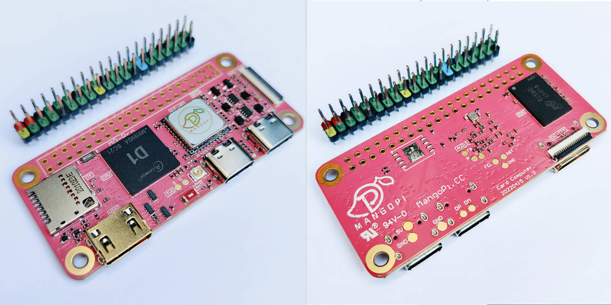
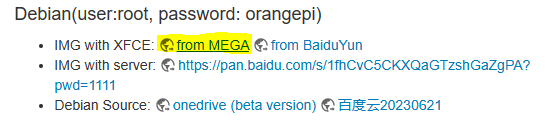
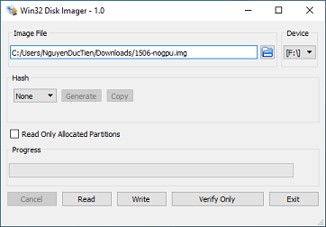
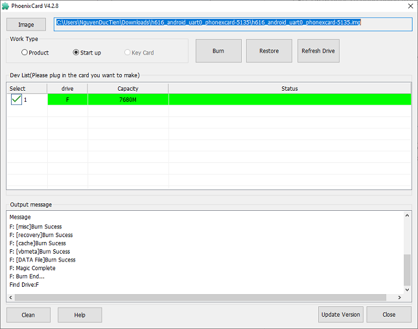
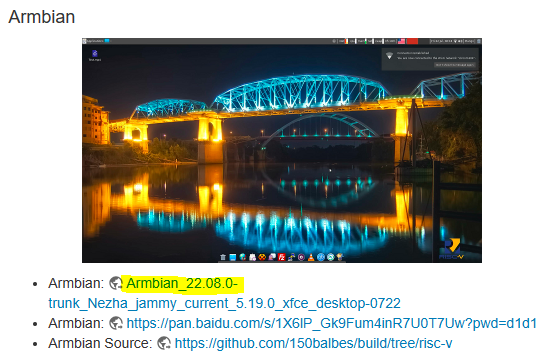
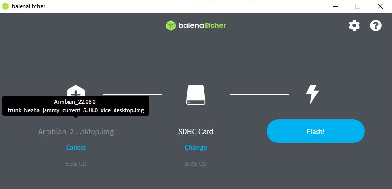
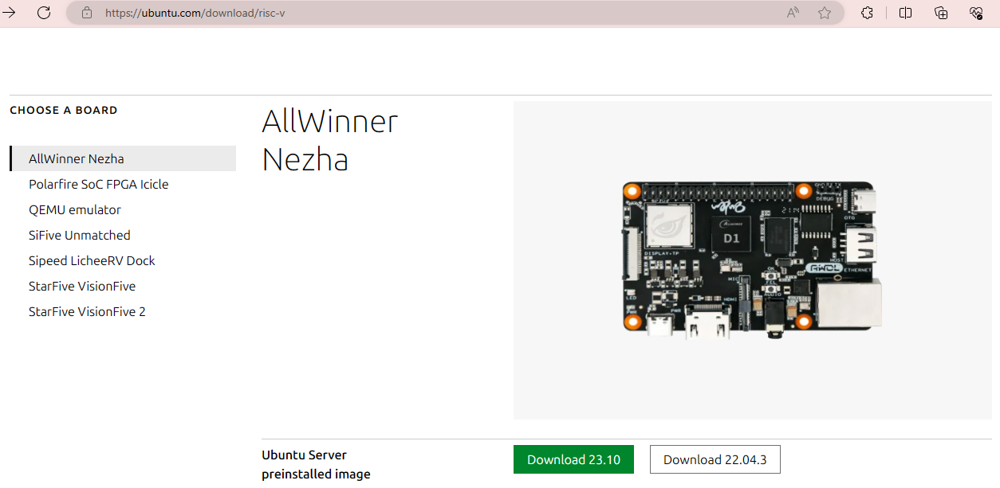

# MÁY TÍNH NHÚNG MANGPOPI

\
Website chính thức: <https://mangopi.org>.

Có 2 loại board sử dụng 2 loại CPU khác nhau, tương thích các GPIO vào ra với RasberryPi Zero.

1. [CPU kiến trúc RISC-V](#mq-quad-sbc-với-cpu)
2. [CPU kiến trúc ARM](#1-mcu-kiến-trúc-risc-v)

## Từ viết tắt

| Từ khóa | Nội dung |
| - | - |
| SBC | Single Board Computer |

## Công cụ khác

| Công cụ | Nội dung |  Link |
| - | - | - |
| balenaEtcher | burn OS image lên thẻ nhớ, đã test ok | <https://etcher.balena.io> |
| Win32DiskImage | burn OS image lên thẻ nhớ | <https://sourceforge.net/projects/win32diskimager/> |
| Rufus | burn OS image lên thẻ nhớ | <https://rufus.ie/vi/> |

## MQ-Quad (SBC) với CPU H616

Website chính thức: <https://mangopi.org/mqquad>

Tóm tắt từ website chính thức, các tài liệu gồm có:
[Sơ đồ nguyên lý schematic](https://mangopi.org/_media/mq-quad-sch-v1p2.pdf) _(đừng nhầm với version v1p1.pdf)_, [Bản vẽ mạch in pcb](https://mangopi.org/_media/mq-quad_v1p2.zip)_(file dfx)_, [H616 datasheet](https://mangopi.org/_media/h616_datasheet_v1.0.pdf) _(các GPIO, giao thức IO)_, [H616 manual](https://mangopi.org/_media/h616_user_manual_v1.0.pdf) _(thanh ghi, timing diagram)_, [AXP313a](https://mangopi.org/_media/axp313a_datasheet_v0.1-20201105.pdf) _(ic nguồn)_, [rtl8723ds](https://mangopi.org/_media/rtl8723ds-cg_datasheet_0.92_20170804.pdf) _(module WiFi 802.11b/g/n + Bluetooth 2.1/4.2)_

CPU: H616 được sử dụng nhiều trong các bộ SetTopBox cho TV Android ([ví dụ](https://www.aliexpress.us/w/wholesale-H616.html?spm=a2g0o.productlist.search.0))

### MQ-Quad ARM: Cài đặt Armbian XFCE

`đã chạy thử: OK`

1. Tải về file img của [firmware](https://mega.nz/file/fepChAzC#1hbbYGGWi29UDfZwU4r8B6whNFLdcdB9uce9jUCT8ok).\

2. Ở phần mềm Win32DiskImager, chọn:
    1. Chọn Image đã tải về.
    2. Chọn Device là thẻ nhớ đã kết nối.
    3. Bấm **Write**.\
    .

Xong. SBC tự chạy vào giao diện X luôn, tự đăng nhập.

### MQ-Quad ARM: Cài đặt Android10 TV

1. Tải về file img của [firmware](https://mega.nz/file/DXwhxACC#_ubCbHQs1UyluqR7WXeGTKNq5yPHS1HgQdzLPN2AAcM) từ website chính thức.
2. Ở phần mềm PhoenixCard, chọn:
    1. Chọn Image đã tải về.
    2. Ở WorkType, chọn **Start up**.
    3. Bấm **Burn**.\
    \

Xong.

> Như phần lựa chọn tool trên website chính thức mô tả: sử dụng **PhoenixCard** cho image **Tina-Linux & Android**; sử dụng **Win32DiskImager/etcher/USBIT** cho image **Debian & ArmBian**.
> Nếu sử dụng PhoenixCard để cài đặt Debian XFCE thì chương trình sẽ crash ngay sau khi bấm nút Burn.

## MQ-Pro (SBC) với CPU D1 RISC-V

Website chính thức: <https://mangopi.org/mqpro>

CPU: Allwinner D1-H SoC với bộ xử lý single-core XuanTie C906 theo kiến trúc RISC-V, chạy ở ở tần số xung nhịp 1.0 GHz

### MQ-Pro Risc-V: Cài đặt Armbian XFCE

`đã chạy thử: OK`

1. Tải về image của hệ điều hành ở đây:\
   source: <https://mangopi.org/mqpro>\
   direct url: <https://disk.yandex.ru/d/da8qJ8wyE1hhcQ/Nezha_D1/ArmbianTV/20220722/Armbian_22.08.0-trunk_Nezha_jammy_current_5.19.0_xfce_desktop.img.xz>\
  
2. Ở phần mềm balenaEtcher, chọn:
    1. Chọn Image đã tải về.
    2. Chọn Device là thẻ nhớ đã kết nối.
    3. Bấm **Flash**.\
   \
_Xong phần cài đặt. Tiếp theo cần cấu hình bước đầu._
3. Khởi động SBC từ thẻ nhớ. Màn hình sẽ hiện ra yêu cầu đăng nhập. Thông tin đăng nhập mặc định là:\
   username: root\
   password: 1234
4. Yêu cầu thay đổi mật khẩu mặc định của root\
   pass: bobcybl8
5. Yêu cầu tạo tài khoản mới để sử dụng giao diện X. \
    usernanme:tiennd
    pass: aycdbbhcm
6. Và các yêu cầu chọn timezone, nhập thông tin wifi, etc\
_Xong_
  
## MQ-Pro Risc-V: Cài đặt Ubuntu Server

`đã chạy thử: OK`

- source: <https://ubuntu.com/download/risc-v>\
  direct url: <https://cdimage.ubuntu.com/releases/23.10/release/ubuntu-23.10-preinstalled-server-riscv64+nezha.img.xz?_ga=2.145654006.314031037.1701768464-1057047120.1698909908>\

- image: ubuntu-22.04.3-preinstalled-server-riscv64+nezha.img.xz
- user: ubuntu
- password: ubuntu\
  changed: bobcybl8
- [Ubuntu on the MangoPi MQ Pro (22.04.1)](https://bret.dk/ubuntu-22-04-mango-pi-mq-pro/)

[//]: # (Ghi chú thoải mái)

Note: `--capt-add=SYS-ADMIN`
