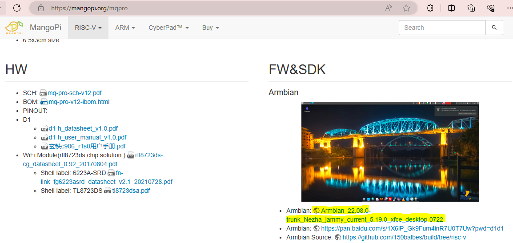

# MÁY TÍNH NHÚNG MANGPOPI

\
Website chính thức: <https://mangopi.org>.

Có 2 loại board sử dụng 2 loại CPU khác nhau, tương thích các GPIO vào ra với RasberryPi Zero.

1. [CPU kiến trúc RISC-V](#mq-quad-sbc-với-cpu)
2. [CPU kiến trúc ARM](#1-mcu-kiến-trúc-risc-v)

## Từ viết tắt

| Từ khóa | Nội dung |
| - | - |
| SBC | Single Board Computer |

## MQ-Quad (SBC) với CPU H616

Website chính thức: <https://mangopi.org/mqquad>

Tóm tắt từ website chính thức, các tài liệu gồm có:
[Sơ đồ nguyên lý schematic](https://mangopi.org/_media/mq-quad-sch-v1p2.pdf) _(đừng nhầm với version v1p1.pdf)_, [Bản vẽ mạch in pcb](https://mangopi.org/_media/mq-quad_v1p2.zip)_(file dfx)_, [H616 datasheet](https://mangopi.org/_media/h616_datasheet_v1.0.pdf) _(các GPIO, giao thức IO)_, [H616 manual](https://mangopi.org/_media/h616_user_manual_v1.0.pdf) _(thanh ghi, timing diagram)_, [AXP313a](https://mangopi.org/_media/axp313a_datasheet_v0.1-20201105.pdf) _(ic nguồn)_, [rtl8723ds](https://mangopi.org/_media/rtl8723ds-cg_datasheet_0.92_20170804.pdf) _(module WiFi 802.11b/g/n + Bluetooth 2.1/4.2)_

CPU: H616 được sử dụng nhiều trong các bộ SetTopBox cho TV Android ([ví dụ](https://www.aliexpress.us/w/wholesale-H616.html?spm=a2g0o.productlist.search.0))

### Cài đặt Debian XFCE

1. Tải về công cụ [Win32DiskImager](https://sourceforge.net/projects/win32diskimager/), hoặc [Rufus](https://rufus.ie/vi/), hoặc tương đương.
2. Tải về file img của [firmware](https://mega.nz/file/fepChAzC#1hbbYGGWi29UDfZwU4r8B6whNFLdcdB9uce9jUCT8ok).\

3. Ở phần mềm Win32DiskImager, chọn:
    1. Chọn Image đã tải về.
    2. Chọn Device là thẻ nhớ đã kết nối.
    3. Bấm **Write**.\
    .

Xong.

### Cài đặt Android10 TV

1. Tải về công cụ [Win32DiskImager](https://mangopi.org/_media/phoenixcard4.2.8.zip) từ website chính thức.
2. Tải về file img của [firmware](https://mega.nz/file/DXwhxACC#_ubCbHQs1UyluqR7WXeGTKNq5yPHS1HgQdzLPN2AAcM) từ website chính thức.
3. Ở phần mềm PhoenixCard, chọn:
    1. Chọn Image đã tải về.
    2. Ở WorkType, chọn **Start up**.
    3. Bấm **Burn**.\
    \

Xong

> Như phần lựa chọn tool trên website chính thức mô tả: sử dụng **PhoenixCard** cho image **Tina-Linux & Android**; sử dụng **Win32DiskImager/etcher/USBIT** cho image **Debian & ArmBian**.
> Nếu sử dụng PhoenixCard để cài đặt Debian XFCE thì chương trình sẽ crash ngay sau khi bấm nút Burn.

## MQ-Pro (SBC)

Website chính thức: <https://mangopi.org/mqpro>

CPU: Allwinner D1-H SoC với bộ xử lý single-core XuanTie C906 theo kiến trúc RISC-V, chạy ở ở tần số xung nhịp 1.0 GHz

### Cài đặt Armbian XFCE

1. Tải về công cụ [Win32DiskImager](https://sourceforge.net/projects/win32diskimager/), hoặc [Rufus](https://rufus.ie/vi/), hoặc tương đương.
2. Tải về file img của [firmware](https://disk.yandex.ru/d/da8qJ8wyE1hhcQ/Nezha_D1/ArmbianTV/20220722/Armbian_22.08.0-trunk_Nezha_jammy_current_5.19.0_xfce_desktop.img.xz).\

3. Ở phần mềm Win32DiskImager, chọn:
    1. Chọn Image đã tải về.
    2. Chọn Device là thẻ nhớ đã kết nối.
    3. Bấm **Write**.\
    .

Xong.

[//]: # (Ghi chú thoải mái)

Note: `--capt-add=SYS-ADMIN`