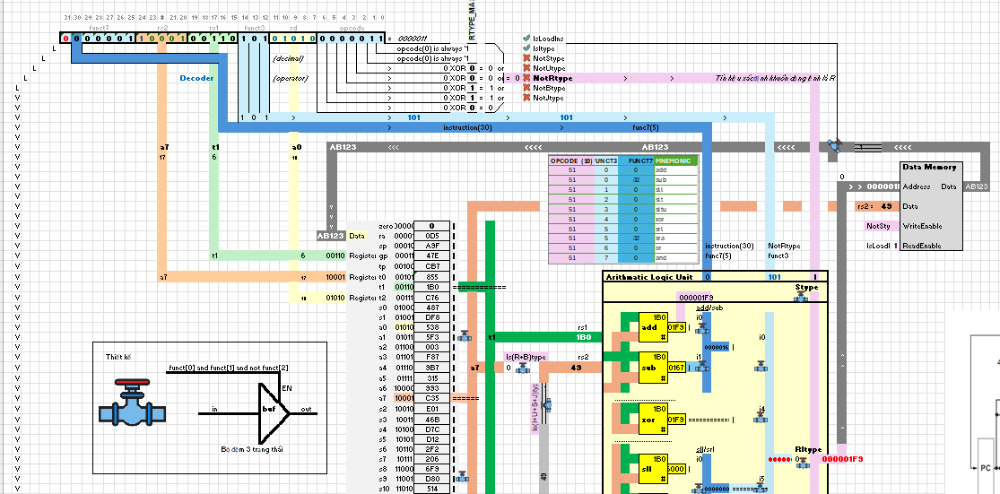

# RISC-V Fundamental Materials

Introduction of computer architecture RISC-V and materials.

Lựa chọn ngôn ngữ / Select language: [Tiếng Việt](./README.md) / [English](./README.en.md)

## Menu of content

- [RISC-V Architecture](RISC-V.vi.md)
- [Simulator RIPES](RIPES.vi.md)
- [Simulator RARS](RARS.vi.md)
- [Real computer, CPU, MCU using architecture RISC-V](https://neittien0110.github.io/MCU/#h%E1%BB%8D-esp32-ki%E1%BA%BFn-tr%C3%BAc-risc-v)

## Others

- [Macro Excel file to explain How to translate an assembly instruction to machinecode, and How machine code impacts to Data Path. Step by step.](https://github.com/neittien0110/RISC-VFundamentalMaterials/blob/master/RISC-V-Design.xlsm)
  - Assembly --> Machine Code (perspective of asm compiler)
  
  - Machine Code --> Datapath (perspective of cpu decoder)
    
- [MangoPi, RISC-C computer](MangoPI.vi.md)

## Table of Contents

- [RISC-V Instruction Set](RISC-V.en.md)
- [Tools](RIPES.en.md)
