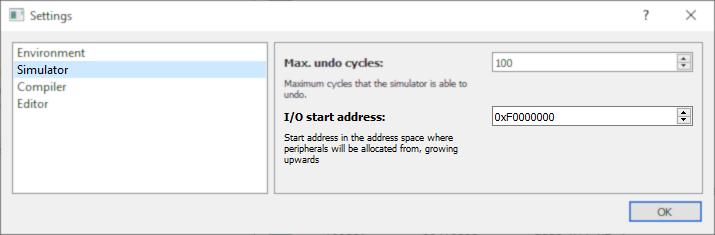
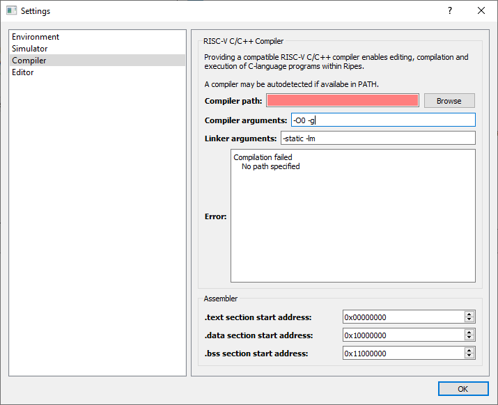
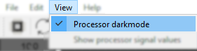
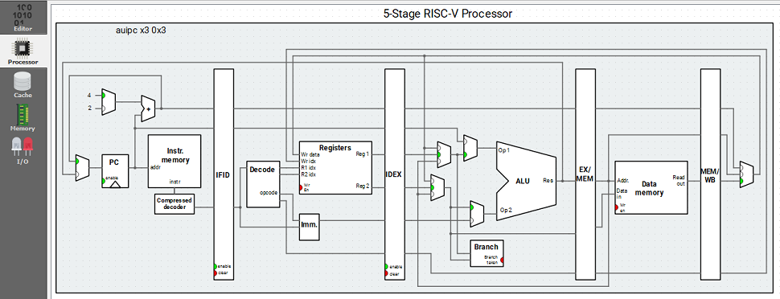
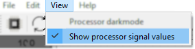
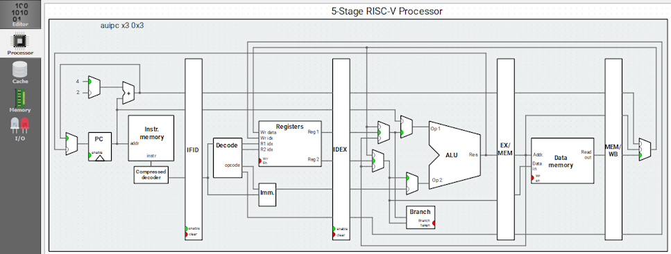

# CÔNG CỤ / TOOLS

1. **Ripes** được sử dụng để chạy mô phỏng các đoạn mã lập trình viết bằng ngôn ngữ C, ngôn ngữ Asm, trên bộ xử lý theo kiến trúc RISC-V với tập lệnh RV32I[M][C].

2. **Visual Studio Code**, kết hợp với extension **PlatformIO** được sử dụng để lập trình C, Asm, trên bộ xử lý thật sử dụng kiến trúc RISC-V như ESP32-C3. Công cụ này cũng có phép chạy debug trực tiếp trên chip RISC-V.

3. **ArduinoIDE** được sử dụng để lập trình C, Asm, trên bộ xử lý thật sử dụng kiến trúc RISC-V như ESP32-C3. Công cụ này không debug trực tiếp trên chip RISC-V.

**Ripes**, được giải thích rõ sau đây, là công cụ chính được sử dụng cho học phần **Thực hành Kiến trúc Máy tính / Computer Architecture Lab**

## RIPES

**Ripes** là mã nguồn mở, có thể tải về mã nguồn để chỉnh sửa, tải về file chạy trực tiếp trên 3 hệ điều hành Windows, Linux, MacOS. Hoặc có thể chạy **Ripes** trực tiếp trên nền web.

- Mã nguồn mở gốc: <https://github.com/mortbopet/Ripes>
- File chạy runtime: <https://github.com/mortbopet/Ripes/releases/tag/v2.2.6>
- Online: <https://ripes.me>

### Không gian địa chỉ vào ra / memory mapped IO

Là dải địa chỉ trong không gian địa chỉ bộ nhớ, nhưng được dành để đánh địa chỉ cho các thiết bị ngoại vi IO. Ripes thiết lập mặc định các địa chỉ bắt đầu từ **0xF0000000** được dành cho vào ra.

Có thể chỉnh sửa được địa chỉ bắt đầu cho không gian IO như sau:

 1. Trên thanh menu, chọn **Edit** / **Settings**.
 2. Ở cửa sổ **Settings**, trong thanh Vertical Tabs bên trái, chọn **Simulator**.
 3. Sửa nội dung trong mục **I/O start address**.

    

### Biên dịch, tối ưu, địa chỉ các phân vùng trong bộ nhớ chính    

Ripes thiết lập mặc định vùng bộ nhớ chính chứa **các lệnh cần thực thi bắt đầu ở địa chỉ 0x00000000**, **các biến, dữ liệu bắt đầu ở địa chỉ 0x10000000**, **các biến, dữ liệu toàn cục chưa được khởi tạo bắt đầu ở địa chỉ 0x11000000**

 1. Trên thanh menu, chọn **Edit** / **Settings**.
 2. Ở cửa sổ **Settings**, trong thanh Vertical Tabs bên trái, chọn **Compiler**.
 3. Sửa nội dung trong mục **Compiler**.
    

### Thay đổi giao diện

- Đổi màu giao diện mô phỏng các công đoạn/stage:
  1. Trên thanh menu, chọn **View** / **Processor darkmode**

    

  2. Kết quả giao diện thay đổi
    
    

- Hiển thị giá trị được truyền đi trên các đường bus bên trong CPU
  1. Trên thanh menu, chọn **View** / **Show processor signal values**

     

  2. Kết quả giao diện thay đổi
    
    
