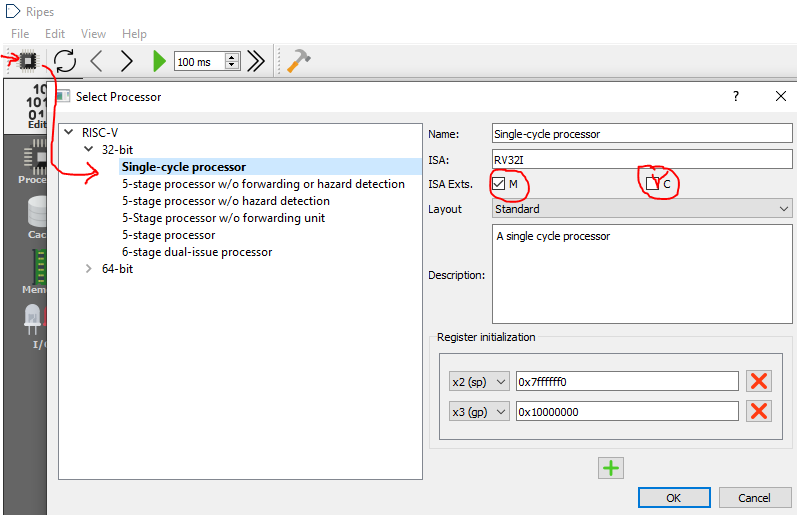
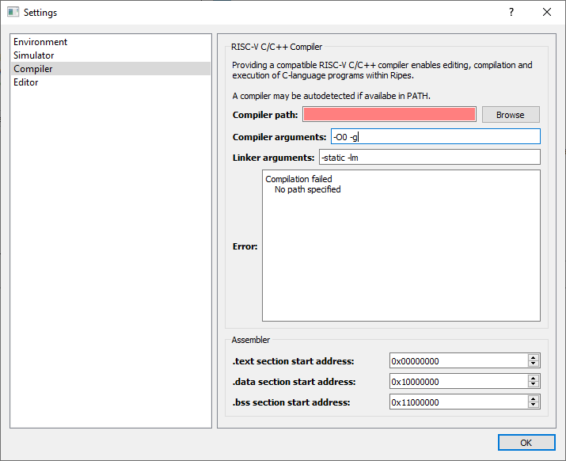
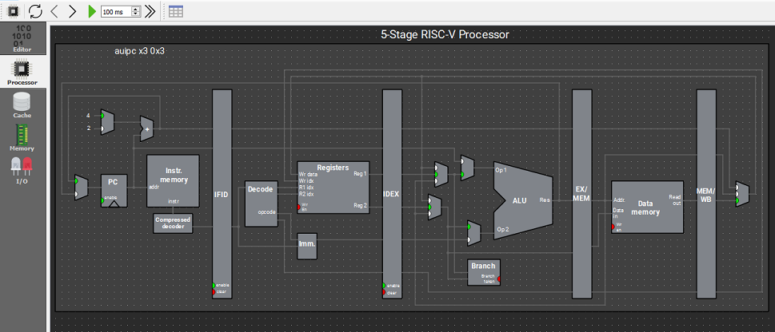
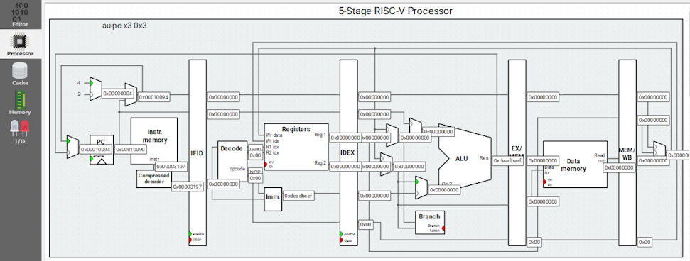

# CÔNG CỤ / TOOLS

**Mục lục:**

- [Sơ lược về Ripes](#sơ-lược-về-ripes)
- [Thiết lập tập lệnh mở rộng](#thiết-lập-tập-lệnh-mở-rộng)
- [Không gian địa chỉ vào ra / memory mapped IO](#không-gian-địa-chỉ-vào-ra--memory-mapped-io)
- [Biên dịch, tối ưu, địa chỉ các phân vùng trong bộ nhớ chính](#biên-dịch-tối-ưu-địa-chỉ-các-phân-vùng-trong-bộ-nhớ-chính)
- [Thay đổi giao diện](#thay-đổi-giao-diện)

---

Các công cụ có thể sử dụng trong lập trình RISC-V, để giúp hiểu rõ về **kiến trúc của bộ xử lý** là:

1. **Ripes** được sử dụng để chạy mô phỏng các đoạn mã lập trình viết bằng ngôn ngữ C, ngôn ngữ Asm, trên bộ xử lý theo kiến trúc RISC-V với tập lệnh RV32I[M][C].

2. **RARS** là một biến thể của công cụ **MARS** (dùng cho kiến trúc MIPS) để biên dịch và chạy giả lập cho kiến trúc RISC-V.

3. **Visual Studio Code**, kết hợp với extension **PlatformIO** được sử dụng để lập trình C, Asm, trên bộ xử lý thật sử dụng kiến trúc RISC-V như ESP32-C3. Công cụ này cũng có phép chạy debug trực tiếp trên chip RISC-V.

4. **ArduinoIDE** được sử dụng để lập trình C, Asm, trên bộ xử lý thật sử dụng kiến trúc RISC-V như ESP32-C3. Công cụ này không debug trực tiếp trên chip RISC-V.

**Ripes**, được giải thích rõ sau đây, là công cụ chính được sử dụng cho học phần **Thực hành Kiến trúc Máy tính / Computer Architecture Lab**

## Sơ lược về RIPES

**Ripes** là mã nguồn mở, có thể tải về mã nguồn để chỉnh sửa, tải về file chạy trực tiếp trên 3 hệ điều hành Windows, Linux, MacOS. Hoặc có thể chạy **Ripes** trực tiếp trên nền web.

- Mã nguồn mở gốc: <https://github.com/mortbopet/Ripes>
- File chạy runtime: <https://github.com/mortbopet/Ripes/releases/tag/v2.2.6>
- Online: <https://ripes.me>

## Thiết lập tập lệnh mở rộng

Ripes thực thie các lệnh theo tập lệnh RISC-V cơ bản là **RV32I** với **I** viết tắt của **Integer** . Ngoài ra, Ripes cũng hỗ trợ giả lập 2 kiến trúc mở rộng là **M**, viết tắt của **Integer Multiplication and Devision**, và **C**, viết tăt của **Compressed**. Ghép các chữ cái này, các tập lệnh RISC32-V mở rộng mà Ripes hỗ trợ là RV32I, RV32IM, RV32IC, RV32IMC. Tương tự với tập lệnh 64bit RV64.

Mặc định, Ripes sử dụng tập lệnh RV32I để biên dịch các mã lệnh. Để tùy chọn **tập lệnh mở rộng RV32I[M][C]**, tiến hành như sau:

1. Trong thanh menubar, bấm vào biểu tượng **Select Processor**.
2. Ở cửa sổ **Select Processor**, trong treeview bên trái, lần lượt chọn từng mục **32-bit/64-bit**, và các mục nhỏ bên trong như **Single_cycle processor**/**5-stages..**/.. Sau đó, tích chọn vào mục **ISA Exts** để kích hoạt các mở rộng của tập lệnh.

3. Bắt đầu có thể lập trình với tập lệnh 16-bit mở rộng.

## Không gian địa chỉ vào ra / memory mapped IO

Là dải địa chỉ trong không gian địa chỉ bộ nhớ, nhưng được dành để đánh địa chỉ cho các thiết bị ngoại vi IO. Ripes thiết lập mặc định các địa chỉ bắt đầu từ **0xF0000000** được dành cho vào ra.

Có thể chỉnh sửa được địa chỉ bắt đầu cho không gian IO như sau:

 1. Trên thanh menu, chọn **Edit** / **Settings**.
 2. Ở cửa sổ **Settings**, trong thanh Vertical Tabs bên trái, chọn **Simulator**.
 3. Sửa nội dung trong mục **I/O start address**.

    

## Biên dịch, tối ưu, địa chỉ các phân vùng trong bộ nhớ chính

Ripes thiết lập mặc định vùng bộ nhớ chính chứa **các lệnh cần thực thi bắt đầu ở địa chỉ 0x00000000**, **các biến, dữ liệu bắt đầu ở địa chỉ 0x10000000**, **các biến, dữ liệu toàn cục chưa được khởi tạo bắt đầu ở địa chỉ 0x11000000**

 1. Trên thanh menu, chọn **Edit** / **Settings**.
 2. Ở cửa sổ **Settings**, trong thanh Vertical Tabs bên trái, chọn **Compiler**.
 3. Sửa nội dung trong mục **Compiler**.

    

## Thay đổi giao diện

- Đổi màu giao diện mô phỏng các công đoạn/stage:
  1. Trên thanh menu, chọn **View** / **Processor darkmode**.

    
  2. Kết quả giao diện thay đổi.

    
    

- Hiển thị giá trị được truyền đi trên các đường bus bên trong CPU
  1. Trên thanh menu, chọn **View** / **Show processor signal values**

     

  2. Kết quả giao diện thay đổi

    
    

### Xem địa chỉ các biến số/nhãn lệnh

Mọi biến, mọi hàm, tổng quát hơn là tên của mọi đối tượng, đều được biên dịch thành hằng số địa chỉ, để CPU qua địa chỉ đó tìm được tới vị trí lưu trữ của đối tượng trong bộ nhớ chính. 

Cách thức để xem địa chỉ biến số/nhãn lệnh như sau:

1. Ở cửa sổ **Editor**, trên thanh điều khiển phía trên, chọn nút bấm **Show symbol navigator**.
2. Ở cửa sổ **Show symbol navigator**, 2 cột:\
  -Cột **Address** chứa địa chỉ của biến số/nhãn lệnh trong mã máy\
  -Cột **Symbol** tên gợi nhớ của biến số/nhãn lệnh trong ngôn ngữ lập trình

Bấm nút **Go to symbol** chưa có tác dụng.